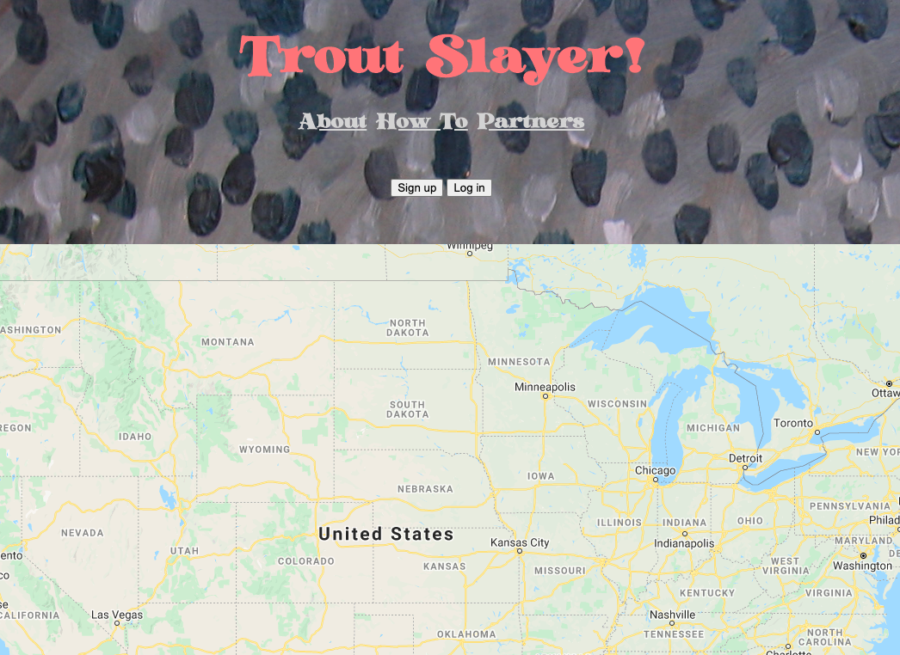

# Cheeki Breeki Deploying
## Using Netlify and Heroku to deploy a frontend/backend monorepo
#### October 2020

## Monoliths!

My first vanilla JavaScript application is called Trout Slayer!, which you can read more about [here](./flatiron/slaying-trout-with-json.html). It's a single-page web application that leverages a Rails backend to store and retrieve data from.

The file structure of the project is simple: the repo is called `trout-slayer`, and the top-level directories are `trout-slayer-frontend` and `trout-slayer-backend`. Either folder holds the frontend (JavaScript) code and the backend (Rails) code, respectively.

I like the simplicity of this structure. It makes it so that I can initialize a single Git repository, `trout-slayer`, and track all code changes to the underlying folders in one spot. Additionally, I don't need to keep track of two separate Git repositories for a single project.


## Deployment woes

The only issue with this setup is that it is a challenge to deploy. The simplest tools to get up and running, like Heroku and Netlify, have their own constraints when it comes to deploying this app specifically.

Namely, Heroku:
1. Doesn't support vanilla JavaScript,
2. Can be expensive with enough usage.

Similarly, Netlify:
1. Doesn't support data persistence (via a database).

But together, they seemed to do what I wanted them to do. So I started entertaining the possibility of deploying my `trout-slayer-frontend` subdir to Netlify and my `trout-slayer-backend` to Heroku, then connecting them up.

## Netlify
I had assumed it'd be easy to setup the frontend code in Netlify, and boy was I right! I signed up for a free account and chose "GitHub" as my Git provider which allowed me to hook into my repository. Because my repo was split, I had to choose the subdir that I wanted to deploy on Netlify, which is `trout-slayer-frontend`. Then I deployed the site, and voila! The frontend code was up on the interwebs within a few seconds. Cheeki!



Of course, this app won't save, augment, or display any data without an accessible backend that's hosted somewhere. That's where Heroku comes in.

## Heroku
First, to account for the Netlify change, I needed to change where my backend was accepting connections from in my Rails `cors` settings:
```
Rails.application.config.middleware.insert_before 0, Rack::Cors do
  allow do
    origins 'https://laughing-jones-91d70a.netlify.app'

    resource '*',
      headers: :any,
      methods: [:get, :post, :put, :patch, :delete, :options, :head]
  end
end
```

While in my backend subdir, I also set up a `Procfile`, which Heroku uses to start our app:
```
web: bundle exec puma -t 5:5 -p ${PORT:-3000} -e ${RACK_ENV:-development}
```

I also needed some kind of `root` route that will present a default page when I visit my Heroku app in a browser:
```
Rails.application.routes.draw do
  root 'markers#index'
  resources :users, only: [:create]
  resources :sessions, only: [:create]
  resources :markers, except: [:update]
end
```

This `root` route will display all of my saved `Marker` records, as JSON.

Out of the box, Heroku assumes that the base directory of your connected GitHub repository is what you want to deploy. And unlike Netlify, it wouldn't let me specify which subdir I wanted to deploy.

Luckily, Heroku has a `buildpack` feature which are essentially initialization scripts that Heroku will run when the app spins up. And lo and behold, someone already wrote the [buildpack scripts](https://github.com/timanovsky/subdir-heroku-buildpack) to do exactly what I wanted. I simply added that to the buildpack settings and create a `PROJECT_PATH` environment variable pointed to `trout-slayer-backend`.

Then I deployed the app, which worked, but I needed to add some Postgres goodies distributed by Heroku via their CLI:
```
addons:create heroku-postgresql -a peaceful-tor-06133
```

Where `peaceful-tor-06133` is the name of my app. After that, I was able to set up the database:
```
heroku run rake db:migrate
heroku run rake db:seed
```

At this point, my backend is running! Huzzah! And because I set up that `root` route earlier, I can easily check this fact in a browser by visiting [https://peaceful-tor-06133.herokuapp.com/](https://peaceful-tor-06133.herokuapp.com/):
```
[
  {
    "id": 1,
    "title": "Big Honkin' catfish in Lebanon KS!",
    "description": "Huge catfish caught in the urban pond behind the Taco Bell",
    "fish_type": "Catfish",
    "weather_conditions": "Overcast",
    "lure_and_bait": "Wooly Bugger",
    "lat": "39.809",
    "long": "-98.555",
    "user_id": 1
  },
  {
    "id": 2,
    "title": "Sandfish in Las Vegas",
    "description": "I lost all my money at the craps so I'm seeking my revenge on the carp","fish_type": "Carp",
    "weather_conditions": "Cloudy",
    "lure_and_bait": "Elk Hair Caddis",
    "lat": "36.114",
    "long": "-115.172",
    "user_id": 1
},
...
```

The only thing left was to change my frontend code to point to the Heroku endpoint any time that there is interaction with the backend:
```
this.usersUrl = 'https://peaceful-tor-06133.herokuapp.com/users'
this.sessionsUrl = 'https://peaceful-tor-06133.herokuapp.com/sessions'
this.markersUrl = 'https://peaceful-tor-06133.herokuapp.com/markers'
```

Breeki!

## [BOOM!](https://laughing-jones-91d70a.netlify.app/)
It lives! It takes a little while to load the markers initially, which I believe is because the Heroku dynos fall asleep if they're not in use. So every time we connect after some time of inactivity, it wakes the lil' bugger up and fleshes out our map with saved markers.

Overall I'm happy with how this setup turned out, though I am thinking through ways to make the app more useful generally and to decrease those load times from Heroku. I am pursuing my AWS Solutions Architect Certification via Udemy/A Cloud Guru. Perhaps...?

[⟵   back to blog](./blog-home.html)
