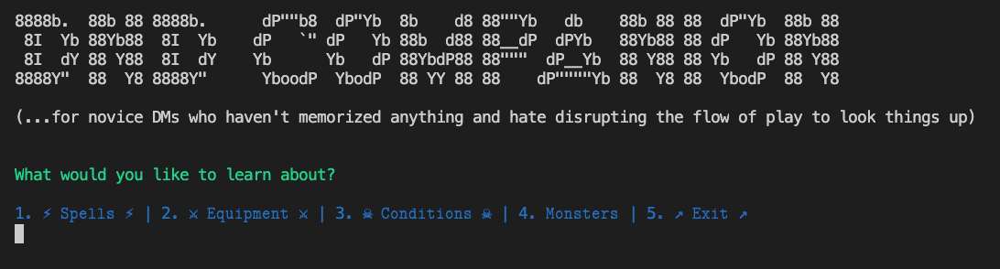

# CLIs and RPGs: an old-school interface for an old-school game

This is a rundown of my first project for the Flatiron School software development bootcamp. You can check out a demo of the project [here](https://www.youtube.com/watch?v=KdRx_dLqikA) and the code [here](https://github.com/mkopsho/dnd-companion).

## dnd-companion

I built a pretty useful CLI application that takes and presents data from [https://www.dnd5eapi.co/](https://www.dnd5eapi.co/) to a would-be dungeon master. I am *very* fortunate to have found a completely public API that is [well-maintained](https://github.com/bagelbits/5e-srd-api) and has an [active community](https://github.com/bagelbits/5e-database) of folks that nurtures and maintains its accuracy.

The app itself does these high-level things:

1. Crawls the API resources of a given endpoint and generates parsed JSON.
2. Collects attributes and instantiates DnD objects from that JSON.
3. Look at the data!

## Crawling resources
When a user spins up the app, they have created a new instance of the `CLI` class, which handles all of the menu behavior. They are immediately greeted by this title card and several menu options:


If they choose any of the menu items (except for "Exit"), a method is called which will parse the user input for the resource and tee that resource off to the appropriate class method. These methods call other methods in an `API` class that do the heavy lifting of getting API responses and parsing the JSON in those responses.

## Collect attributes and instantiate objects
Now that we have some JSON to play with, we can start grabbing the information that we want to flesh out our object attributes. Each menu item listed above has its own class to establish a clear dilineation between objects. They also have unique attributes; for example, a single `spell` object looks like this when created:
```
=> #<Spell:0x00007fd84fa9b6c0
 @casting_time="1 action",
 @components=["V", "S", "M"],
 @concentration=false,
 @description=
  "A shimmering green arrow streaks toward a target within range and bursts in a spray of acid. Make a ranged spell at
tack against the target. On a hit, the target takes 4d4 acid damage immediately and 2d4 acid damage at the end of its next turn. On a miss, the arrow splashes the target with acid for half as much of the initial damage and no damage at the end of its next turn.",
 @duration="Instantaneous",
 @higher_level=
  ["When you cast this spell using a spell slot of 3rd level or higher, the damage (both initial and later) increases by 1d4 for each slot level above 2nd."],
 @klasses=["Wizard"],
 @level="2",
 @materials="Powdered rhubarb leaf and an adder's stomach.",
 @name="Acid Arrow",
 @range="90 feet",
 @ritual=false,
 @school="Evocation">
```
Other data -- like `equipment`, `conditions`, and `monsters` -- get their own unique attributes.

## Get data!
Now, the fun part! We can look at each of these objects in a way that makes sense, like looking at spells by class *and* level:


Or equipment stats:


Or monsters by challenge rating (CR):


Awesome! These all get handled by the CLI class, which houses methods that iterate through the appropriate list of objects and displays the data that fits our user's criteria (and formats it too!).

## Observations had and lessons learned
### Plan, plan, plan! (and limit scope)
I spent the weekend before the project was due pondering the design of this project but never committed anything to paper, and that was probably a mistake. I had a baseline "MVP" in mind, which was to get and display information about conditions, spells, and equipment. After that was done, however, I started branching out into monsters and started a character generator. While I'm happy with the results of working on the `Monster` class, I ended up shuttering the character generator because it was very complex and I wouldn't be able to finish it in time. I spent a few hours on this when I could have been refactoring and refining my code to make it truly polished!

### Refactor, refine, and stay DRY

### 
