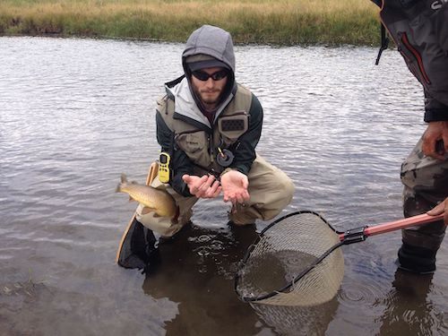
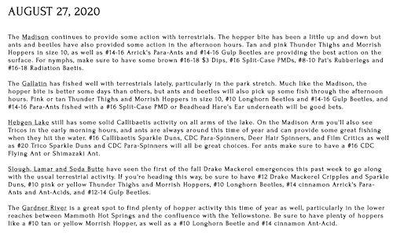

# Lumbering JSON Catapults: JS + Rails API
#### August 2020

The **real** trout slayer!

This post details my fourth project for the Flatiron School software development bootcamp. It's a small web app meant to help people track and share their catches with each other! It was written in vanilla Javascript for the frontend and uses the Rails API as the backend. You can check out the code [here](https://github.com/mkopsho/trout-slayer).

## Trout Slayer!

Despite the name, we are not literally slaying trout with this app. Instead, this app is meant to help folks track and share their catches. It's also a good way to store data about the conditions of the catch; like fish species, size, and dimension, the weather, and the lure or bait used.

The idea for this app originated when I started fly fishing with a few friends. One of my friends had been doing it for over a decade and wanted to share the rich world of fly fishing with others, and I gladly obliged! We all shipped out to Bozeman, Montana, and drove several hours south. We would spend most of our days fishing around there and in west Yellowstone.

One of the things that stood out to me was how low-tech fishing was. That's probably a good thing (who wants to think about data while relaxing and fishing?), but it became difficult when sharing knowledge. What were the fish in the area biting on that day? Which lures would be good? How variable were the weather conditions in this part of the state park? We had a lot of fun answering these questions ourselves, but that's what sparked the idea behind this app. It would be stellar to have a lightweight and accessible webapp that anyone could use to answer these questions!

[Some folks](https://www.blueribbonflies.com/) do this really well!

## Requirements
The initial requirements were simple:
1. Users can open a web page with a Google Map,
2. Users can see everyone's map markers,
3. Users could sign up and log in,
4. Once logged in, users could create their own markers,
5. Once they have created markers, they could toggle their own!

I wanted to make all of the markers public so that anyone can peruse... but I strongly encourage users to signup and make pins of their own!

## Planning
While we've already learned the ins and outs of Rails and had been learning how to code in Javascript for 3 weeks up to this point, a major unknown in this project was the Google Maps API. Luckily, their [documentation](https://developers.google.com/maps/documentation) was extremely thorough and helped me out in a big way.

Since this is a single-page application, my major focus was on the map: I wanted it to take up the most space on the page to be the focus. I could render anything else I needed in a popup or an overlay window.

And that's essentially what I ended up doing; the map takes precedent over all other elements, the app title and menu items are fixed, and all other elements are dynamically rendered in the DOM depending on what the user does.

## Challenges
I had a couple major challenges with this project, but I think I'm better off for working through them.

### Google Maps API Classes
Because I'm using the Google Maps API, the `Map` and `Marker` classes are fully encapsulated and cannot be modified. This got pretty confusing pretty quickly because I had *my own* Javascript `Marker` class. I found out pretty quickly that variables I had naively named `marker` could be either a Google marker or my own, which both had unique sets of functions.

I spent a good chunk of time refactoring to account for this. One of the things that made it easier was instantiating both objects during marker creation, then shoving both objects into separate arrays. This way I had two unique collections of markers and could call their functions on either depending on my needs.

Since Google Maps objects extend the [MVCObject class](https://developers.google.com/maps/documentation/javascript/reference/event#MVCObject), I was able to use `.set` to add some data after instantiation to link my otherwise-separate objects together. I added both the database `id` of the saved object and the `user_id` to which the Google marker object belonged to. I could then delete and toggle these markers with ease!

### Authentication and Authorization
This is still an open issue! I wrote a [disclaimer](https://github.com/mkopsho/trout-slayer/blob/master/README.md#security-disclaimer) on my README detailing the problem. The gist is that in the interest of time, I simply create an empty `session` object when the page loads, then I'll add the `id` of the user that is logged in. I'll use this value to authorize a user to delete and/or toggle their own markers. This means that a user can simply change the value of `id` via the DOM to become someone else! The ultimate doppelgänger!

This is quite obviously terrible and will need to be fixed before I host the app anywhere, which I would like to do. I will be reading up on [JSON Web Tokens (JWT)](https://jwt.io/) and going from there.

## Final Thoughts
Overall, this was a project that challenged by perception of how programming languages typically behave; the differences between object oriented programming and functional programming are stunning. Javascript does have decent ways to build OOP programs with its classes, but the real magic of Javascript seems to be throwing around functions.
