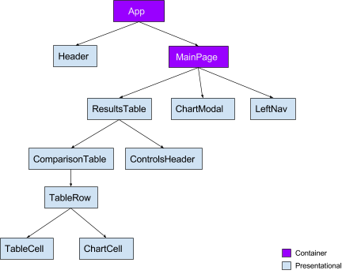
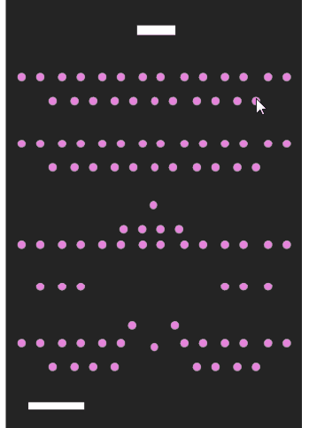

# React, Conventions, and Stewardship
## Leaving things better than how you found them
#### September 2020


This post details my fifth and final project for the Flatiron School software development bootcamp. It's a small app that crawls and shares National Park data from the [NPS API](https://www.nps.gov/subjects/developer/index.htm). The frontend was written in React and uses the Rails API for its backend. You can check out the code [here](https://github.com/mkopsho/stwrdshp).

## Stewardship
I'm not sure who said this first, and the internet attributes it to several dozen people, but a saying that has always stuck with me is this:
> Leave this world a little better than you found it.

It's straightforward, punchy, and evocative. It's a saying that encourages continuous improvement, maintenance, and building a better future for those who come after you. It can apply to any context; I stick to this principle in my personal and professional life all of the time. In my mind, this phrase is synonymous with the word *stewardship*, which, according to the Oxford Dictionary, means:
> The job of supervising or taking care of something, such as an organization or property.

Our national park service and the parks therein are a prime example and extension of this concept. It also largely influenced the name of the project (STWRDSHP) and what it's meant to help people do: search, find out about, favorite, and visit our national parks.

## React Componentry



The major requirements for this project were fairly straightforward:
1. There should be 2 container and 5 stateless components,
2. There should be 3 routes (using [react-router](https://reactrouter.com/)),
3. Use [Redux](https://redux.js.org/) and [Thunk](https://github.com/reduxjs/redux-thunk) for state persistance and asynchronous actions,
4. The Rails API should handle the data persistence with a database.

And a couple of other minor requirements. With these in mind, I came up with a high-level plan:
1. Build the Rails backend first, starting with Model attributes and relationships, seed/mock data, and basic Controller functionality for endpoints that I planned to use in the frontend,
2. Build the React frontend with [react-create-app](https://github.com/facebook/create-react-app), which sets up a few small conventions for us,
3. Build all of the React components from scratch *without* using a global Redux store nor Thunk, building container components and passing down props as needed,
4. *Refactor* each component to use Redux and Thunk where necessary.

The goal here was to not prematurely optimize my app and use functionality and code that I didn't necessarily need. While Redux is a game-changer in a lot of ways, not every component needs to be hooked up to a global store, which we'll see shortly.

A secondary goal was more a personal one: I believe that building things in this way forces me to learn the ins and outs of every component and its relationship with other components. This intimate knowledge of my own app not only helps me to make big changes to it later, it also helps me "level up" my React knowledge generally!

## Refactoring into Conventions



*This* is what it sometimes feels like to keep track of props.

A good chunk of my components ended up being stateless and presentational, which simply means that they do not have a `state` object that needs to be kept track of. For example, a component can be as simple as a "Home" or "About" page:
```
import React from 'react'

const About = () => {
  return (
    <section className="hero is-fullheight is-primary has-bg-img-about">
      <div className="hero-body">
        <div className="container has-text-centered">
          <h1 className="title">
            About
          </h1>
          <h2 className="subtitle">
            We grab all of our parks data from the <a href="https://nps.gov/index.htm" style={{ textDecorationLine: 'underline' }}>National Park Service's API</a>. You can browse the parks without signing up.
          </h2>
          <h2 className="subtitle">
            If you do sign up, you have the ability to like parks and add them to a list. Give it a try!
          </h2>
        </div>
      </div>
    </section>
  )
}

export default About
```

All that this component is doing is returning [JSX](https://reactjs.org/docs/introducing-jsx.html) that defines the HTML that will be returned when this `About` component is rendered. We `export` this component and refer to it in our main `App.js` page:
```
import React from 'react' 
import About from './components/About'
...

function App() {
  return (
    <Router>
      <div>
        <NavBar />
        <Switch>
          <Route exact path="/" component={Home} />
          <Route exact path="/about" component={About} />
          <Route path="/parks/:parkId" component={Park} />
          <Route exact path="/parks" component={ParksContainer} />
          <Route exact path="/likes" component={LikesContainer} />
          <Route exact path="/login" component={LogIn} />
          <Route exact path="/signup" component={SignUp} />
          <Route exact path="/logout" component={LogOut} />
        </Switch>
        <Route component={Footer} />
      </div>
    </Router>
  )
}

export default App
```
Using react-router, the `About` component will render if someone hits the `/about` path. The link to which is specified in our `NavBar` component, which is also rendered via `App.js`. Sidenote: this is also still technically a [SPA](https://en.wikipedia.org/wiki/Single-page_application), even though we are mocking how a more traditional CRUD web app would look.

Presentational components like this typically do not need data, and if they did, they can get it from props passed down from a parent (stateful) component.

Of course, with any React app that has more than a few components, sharing state between parent, sibling, and cousin components is almost required. Because you want some common data shared amongst those components, you have to have a stateful component pass that data down to its children as [props](https://reactjs.org/docs/components-and-props.html). This can become a real PITA if you need to share data between sibling or cousin components, as they have to traverse some data up to a common parent to pass that data back down the tree to a target component as props.

### Redux


This is where Redux comes in; we can build a global data store, configure that store with any number of [reducers](https://redux.js.org/basics/reducers), and "hook up" components to the store to use its data. After having built all of the components *without* Redux, I went back and refactored the ones that made sense to hook up to a store:
```
...imports...

const rootReducer = combineReducers({
  likes: likeReducer,
  parks: parkReducer,
  users: userReducer
})

const store = createStore(rootReducer)

ReactDOM.render(
  <React.StrictMode>
    <Provider store={store} >
      <App />
    </Provider>
  </React.StrictMode>,
  document.getElementById('root')
)
```
As you can see, I combine three reducers to configure my global store, which ends up looking something like this when reduced (the actual config can be found within those reducer files):
```
likes: {
  likedParks: []
},
parks: { 
  filteredList: [],
  stateCode:"",
  parkName: "",
  loadingParks: false
},
users: {
  username: "",
  email: "",
  password: "",
  isLoggedIn: false
}
```
So long as I hook up a component to this store, it now has access to this data as props! I can also specify which "slice" of the store I want, so for the `LogIn` component, I only really need access to the `users` object in my store:
```
const mapStateToProps = (state) => {
  return state.users
}

export default connect(mapStateToProps)(LogIn)
```
Now the `LogIn` component has access to the `users` slice of my store! Rad~!

## React Stewardship
Approaching my React project in this way (components from scratch -> refactor with new functionality) was really quite therapeutic. It felt genuinely good to make massive perceived improvements to this codebase simply by using a global store and asynchronous function handling. Over time, the codebase started to become more readable and reusable. There are strong conventions that are repeated throughout the frontend code, which makes it a bit more robust and resilient to future work.

I believe one of the reasons why it felt so therapeutic is because of the concept of *stewardship*, or taking care of something. It felt like I was "leaving a project better than I found it", even if that "found project" was just a version I had written on the previous day. It also felt good to extend the mission of ["convention over configuration"](https://en.wikipedia.org/wiki/Convention_over_configuration), which is a Rails concept that I've come to love.

Thanks for taking the time to read this, and be good stewards!

[⟵   back to blog](./blog-flatiron.html)
